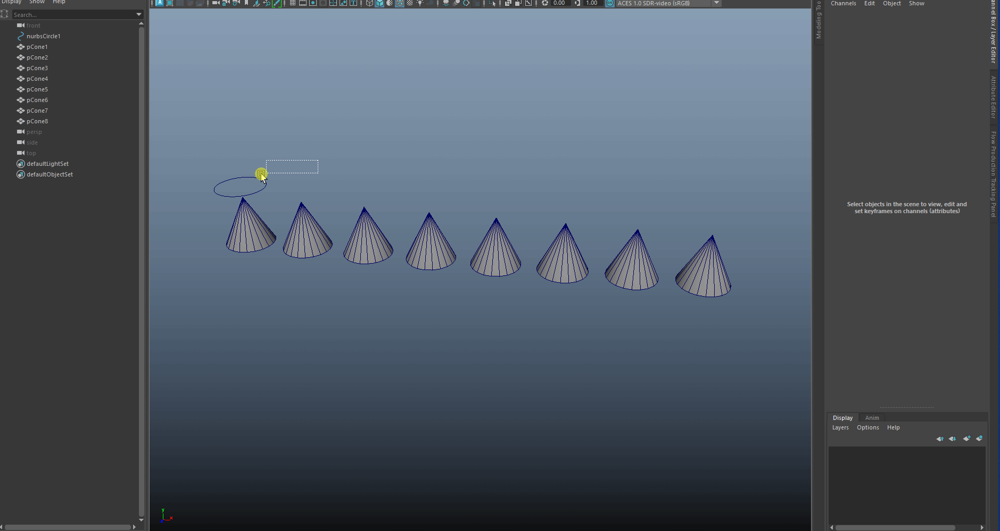

# オブジェクトにアトリビュートを接続するツール

## 概要
複数のオブジェクトアトリビュートを一括で接続するためのツールです。

## インストール方法
 - FT_connect_attr.pyファイルをMayaのスクリプトディレクトリに配置します。
    - Windows: C:\Users\<ユーザー名>\Documents\maya\scripts
    - Mac: ~/Library/Preferences/Autodesk/maya/scripts
    - Linux: ~/maya/scripts

## 使用方法


1. スクリプトをMayaのスクリプトエディタで実行するか、Pythonモジュールとしてインポートします。

   ```python
   import FT_connect_attr
   FT_connect_attr.show_window()
   ```

2. ドライバーのアトリビュートを選択して「<<」ボタンで追加
3. ドリブンオブジェクトとアトリビュートを選択して「Add」ボタンでリストに追加
4. 「Connect All」ボタンをクリックして、すべての接続を一括で実行

## エラー処理

以下の場合にエラーメッセージが表示されます：

- ドライバーの選択時に複数のオブジェクトまたはアトリビュートが選択されている
- アトリビュートが選択されていない状態で操作を実行
- 接続実行時にドライバーまたはドリブンが未設定

## 動作環境
- Autodesk Maya
- Python 2.7以上

## バージョン
- 1.0: 初版リリース